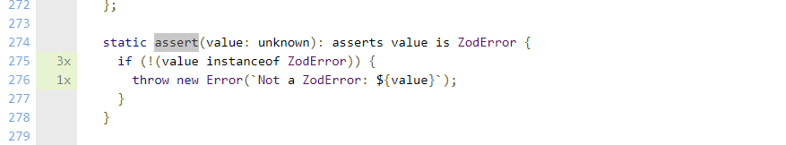

# Report for Assignment 1 Resit

## Project chosen

Name: Zod

URL: https://github.com/colinhacks/zod

Number of lines of code and the tool used to count it: 410107, lizard

Programming language: TypeScript

## Coverage measurement with existing tool

Name of the tool: jslint

Command for coverage: `$ yarn test --coverage` \
Command for the testfile: `yarn test error.test.ts`

Screenshot of result, overall coverage All Files: 

Screenshot of result, overall coverage of the file we are going to modify, SRC files: 

## Coverage improvement
### Individual Tests

Function1 name: toString() (in src\ZodError.ts)

Link to commit: https://github.com/AlexandruMititelu/A1.1-SEP-RESIT/commit/b1e85b473ddd7a0569d2cf721af43170ba145037#diff-963488388f2d2a25e911faefec356261084f012195e56a66c6ff7194e55f9cf7

Screenshot of before :  

Screenshot of after:  

Overall SRC coverage after this improvement:

#
Function2 name: assert(value: unknown) (in src\ZodError.ts)

Link to commit: https://github.com/AlexandruMititelu/A1.1-SEP-RESIT/commit/b1e85b473ddd7a0569d2cf721af43170ba145037#diff-963488388f2d2a25e911faefec356261084f012195e56a66c6ff7194e55f9cf7

Screenshot of before :  

Screenshot of after:  

Overall coverage after this improvement:

Overall branch coverage improved by 4% in the ZoddErro.js file, to 80%. 100% of the function branches have been covered. It works because when the function is called, it expects to throw an error with the message that we gave.

#
Function3 name: get errors() (in src\ZodError.ts)

Link to commit: https://github.com/AlexandruMititelu/A1.1-SEP-RESIT/commit/377b96c5acc8fe16e064466f6d379c49802d9d7e

Screenshot of before :  

Screenshot of after:  

Overall coverage after this improvement:

#
Function4 name:  format(_mapper?: any) (in src\ZodError.ts)

Link to commit: https://github.com/AlexandruMititelu/A1.1-SEP-RESIT/commit/1ae47f0621ab78c9a3e1de83bba90fb7dca335f8#diff-963488388f2d2a25e911faefec356261084f012195e56a66c6ff7194e55f9cf7

Screenshot of before :  

Screenshot of after:  

Overall coverage after this improvement:

Overall branch coverage improved by 12% in the ZoddErro.js file, to 92%. 100% of the function branches have been covered. It works because for every covered branch, when format is called with a specific mapper, it will return the error message that we gave.
#
### Overall

Screenshot of original result, overall coverage All Files: 

Screenshot of result, overall coverage of the file we have modified in SRC: 

New Coverage, All files:

New Coverage, SRC files:

As is seen in the screenshots, the coverage in that particular file ZoddError.ts was improved from 76% to 91.13%., statement coverage from 85.93% to 95.91%, function coverage from 81.25% to 93.96%. If one checks the lines that were missing before and compares it to the old code one can easily see that the missing lines(red) are now green, meaning tested. Out of 4 functions improved, 2 (function 2 & function 4) of them had if branches, going from 0%  branch coverage to 100%(see that they are not red anymore). 

Overall in all files, we have improved: statement coverage 95.53% to 95.91%, function coverage 93.43% to 93.96%, branch coverage 90.55% to 91.13%.

Link to the slides:
https://docs.google.com/presentation/d/1FqbQYH7BRJwMV4EC2VnmxTNJajOnKH8YlXyUeRCZzvY/edit?usp=drive_link
